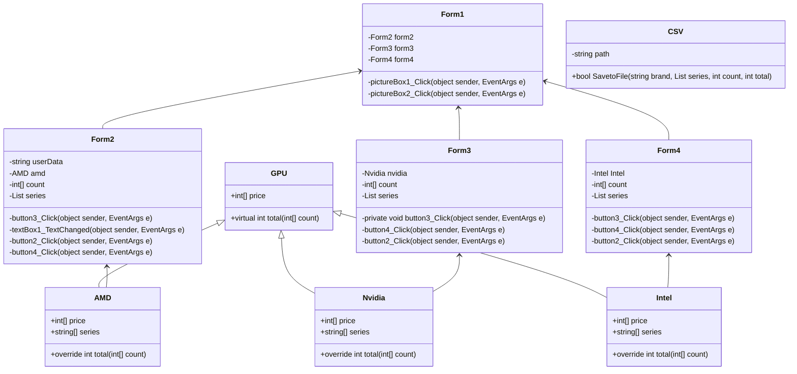

### ความเป็นมา
    การหาซื้อการ์ดจอในปัจจุบันเป็นเรื่องที่ยากเพราะมักชอบที่จะมีนักลงทุนซื้อไปทีละเยอะๆ หรือซื้อหมดร้าน เราจึงสร้างร้านที่ทุกคนสามารถเข้าถึงการ์ดจอได้
### วัตถุประสงค์
    ผมได้สร้างโปรแกรมการจัดซื้อการ์ดจอที่สามารถซื้อได้ไม่กี่คลิ๊ก
### โครงสร้างโปรแกรม

### ผู้พัฒนาโปรแกรม
นายกิตติพงศ์ อยู่สุภาพ
รหัสนักศึกษา 663450171-7
